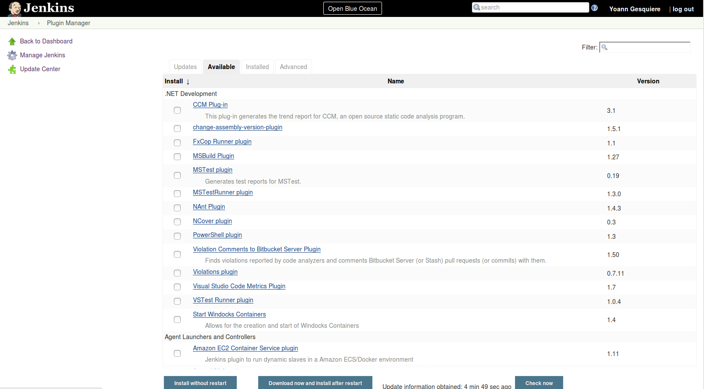
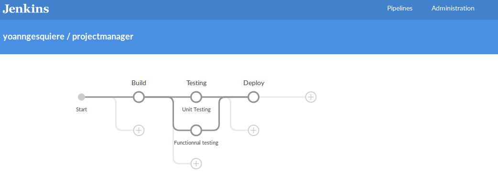

Title: Let's try Jenkins
Date: 2017-04-20 13:00
Modified: 2017-04-20 13:00
Category: Tools
Tags: jenkins, tips
Authors: Yoann Gesquiere

Currently, I use Travis CI for my github projects. Well, it does the job, but I wanted to try another CI.  
Jenkins is used where I work, so let's give it a try. 

I chose to use the docker version:

```
docker pull jenkins
mkdir jenkins
docker run -d -p 49001:8080 -v $PWD/jenkins:/var/jenkins_home -t jenkins
```

And it's on. 

The first page invite you to install some recommended plugins. And it's really easy to add some more in 
*Manage Jenkins* -> *Manage Plugins*



I installed the new UI (Blue Ocean) to use the simplified pipeline management.
To access this new interface, just add */blue* at the end of jenkins url.

If you don't know about pipelines, just follow [this link](https://jenkins.io/doc/book/pipeline/).

It is possible to create a pipeline in a few simple steps. First click on *New Pipeline* then follow the instructions.
If there is no Jenkinsfile on the repository, it is possible to create one directly from jenkins UI and commit it to
master or another branch.



It is really simple to use.
